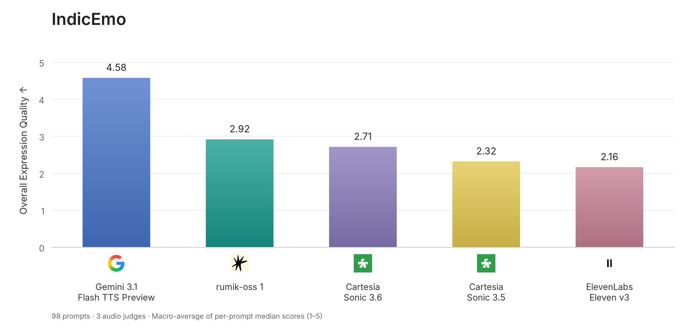

# IndicEmo

A Benchmark for Emotional Expressiveness in Multilingual, Code-Switched TTS

[](LICENSE)

[Benchmark inputs](benchmark/prompts.jsonl) · [Methodology](METHODOLOGY.md) · [Evaluation prompt](evaluation/prompts/emotion_comparative_5way_v1.txt) · [Generation configurations](generation_recipes.json)

IndicEmo evaluates emotional expressiveness in multilingual, code-switched speech synthesis. The task is to synthesize a specified transcript while performing a requested emotion or speaking style across changes of language within the utterance.

The published experiment comprises 100 tasks and 500 matched recordings from five TTS configurations. Three audio-capable judges assess the audible performance using an anchored Expression Quality rubric. This repository provides text inputs, frozen generation requests, numeric judgments, result tables, and evaluation code. Generated recordings and judges' free-text responses are not bundled. Score reproduction works offline; generating and judging new recordings requires your own provider access.

## Motivation

Our evaluation question is specific: **can a TTS system deliver a convincing emotion while speaking an utterance that switches between Indian languages and English?** Correct words and clean audio are necessary, but neither establishes that a performance sounds genuinely happy, sad, angry, or excited.

[InstructTTSEval](https://arxiv.org/abs/2506.16381) was the closest methodological reference we found for description-conditioned synthesis. It evaluates natural-language style instructions through acoustic-parameter specification, descriptive-style directives, and role-play, using audio-capable automated judging. Its released tasks cover English and Chinese. That makes it a useful starting point, but not a direct evaluation set for our languages and code-switching use case.

We therefore built a separate task set and adapted the evaluation around three requirements:

1. **Multilingual utterances, not translated monolingual tests.** Our language pool spans English, Hindi, Telugu, Tamil, Kannada, Bengali, and Punjabi. Their pronunciation, rhythm, and expressive conventions differ; translating an English prompt alone would not test delivery through within-utterance language changes. Each IndicEmo transcript combines two to five languages.
2. **A shared, bounded control task.** Each task specifies a delivery category, anchor accent, and pace, mapped to each provider's supported interface. This targets our categorical description controls rather than InstructTTSEval's broader free-form instruction-following task.
3. **Degree of expression, not just emotion detection.** Judges compare matched recordings and score how convincingly the requested delivery is performed on an anchored 1–5 scale. A recognizable but weak performance should be distinguishable from a strongly expressed one; the result is not merely a correct-label count or winner frequency.

IndicEmo contains original prompts, not a subset or translation of InstructTTSEval. Its headline score measures emotional expression **in a code-switched setting**, not code-switching correctness, native-accent accuracy, or general TTS quality. Professional is reported as a speaking style, with a separate emotion-only aggregate. The [methodology](METHODOLOGY.md) documents these boundaries and the limitations of automated judges.

## Results

Scores are on a 1–5 scale; higher is better. Overall includes all five delivery categories. Emotions only excludes Professional, which is a speaking style.



| System | Overall | Emotions only | Happy | Sad | Angry | Excited | Professional |
| --- | ---: | ---: | ---: | ---: | ---: | ---: | ---: |
| Gemini 3.1 Flash TTS Preview | 4.58 | 4.66 | 4.40 | 4.90 | 4.58 | 4.75 | 4.26 |
| **rumik-oss 1** | **2.92** | **3.03** | 2.95 | 2.50 | 3.37 | 3.30 | 2.47 |
| Cartesia Sonic 3.6 | 2.71 | 2.51 | 2.95 | 2.10 | 1.95 | 3.05 | 3.53 |
| Cartesia Sonic 3.5 | 2.32 | 2.18 | 2.45 | 1.95 | 2.05 | 2.25 | 2.89 |
| ElevenLabs Eleven v3 | 2.16 | 2.03 | 2.45 | 2.20 | 1.74 | 1.75 | 2.68 |


Vector figures: [overall](assets/indicemo_results.svg) · [per-delivery breakdown](assets/indicemo_by_delivery.svg). Both figures use the same canonical scores as the table.

### Rebuild the figures

From the repository root:

```bash
python -m pip install -r requirements-figures.txt
python build_figures.py
```

This reads `benchmark/results/consensus_scores.csv` and regenerates the PNG and
editable SVG figures under `assets/`, without network access or model calls.
The figure renderer and required logos are included. Presentation uses
`rumik-oss 1`; frozen records retain their historical names and identifiers.
Further experimental details will be provided in a forthcoming technical report.

Cartesia Sonic 3.6 is the configuration recorded as `sonic-preview` in the original
requests. Archived CSVs retain the historical display name "Cartesia Sonic Preview"
and system ID `cartesia_sonic_preview`; the figures use the product name. No scores
or recorded API identifiers have been changed.

Results use the 98 tasks with valid responses from all three judges. Gemini and Qwen have 100 valid cases each; OpenAI has 98. Tasks `cs_0046` and `cs_0098` are excluded for every system, while both prompts remain in the input set. Retained category counts are Happy 20, Sad 20, Angry 19, Excited 20, and Professional 19.

For each task and system, take the median of the three judge scores. Average these task medians within each delivery category, then give each category equal weight. The emotion-only aggregate uses the four emotion categories and 79 tasks. The table is rounded from the canonical CSV, which the reproduction command below checks exactly.

These are automated judgments of the specified inference configurations. They are not human MOS, accent-accuracy scores, or a measure of transcript correctness. See [interpretation and limitations](METHODOLOGY.md#13-interpretation-and-limitations).

### Judge dependence and possible same-family bias

The Gemini judge showed a more pronounced preference for Gemini TTS than the other judges. Across the 98 shared tasks, it assigned Gemini TTS a mean score of 4.73/5, compared with 4.66 from Qwen and 3.73 from OpenAI. Qwen's similarly high score is important context: this observation does not establish that Gemini recognized its own model family or that the preference was caused by same-family bias. Differences in perceived performance, scoring calibration, and shared preferences remain alternative explanations.

Our judge panel was constrained by practical access to audio-capable models for this multilingual comparison; it is not an exhaustive or independently calibrated panel. Using three providers and a per-task median reduces reliance on any one judge, but does not eliminate correlated or same-family preferences. We report this as a limitation, not a basis for adjusting scores. See the [per-judge evidence and discussion](METHODOLOGY.md#13-interpretation-and-limitations).

## Task Coverage

The language pool is English (`en`), Hindi (`hi`), Telugu (`te`), Tamil (`ta`), Kannada (`kn`), Bengali (`bn`), and Punjabi (`pa`). Each transcript combines two to five languages; the set contains 79 distinct language orders.

| Dimension | Distribution |
| --- | --- |
| Target delivery | Happy 20, Sad 20, Angry 20, Excited 20, Professional 20 |
| Languages per utterance | 2: 30 tasks; 3: 25; 4: 25; 5: 20 |
| Requested pace | Slow 17, Steady 51, Fast 32 |
| Anchor accent | Hindi 15, Kannada 15; each remaining condition 14 |

Each task specifies text, delivery, anchor accent, and pace. Systems receive the same intended text through their supported control interfaces. rumik-oss 1 uses Ira throughout; commercial systems use fixed voices selected for the corresponding language conditions. The comparison includes voice choice and provider controls. There was no exhaustive search over every available voice.

## Installation

Use Python 3.12 or 3.13 on Linux, the CI-tested versions. Score reproduction and hosted API evaluation run on CPU. Hosting a TTS model has separate hardware requirements.

```bash
git clone https://github.com/ira-rumik/IndicEmo.git
cd IndicEmo
python -m venv .venv
source .venv/bin/activate
python -m pip install --require-hashes -r requirements.lock
python -m unittest discover -s tests -v
```

`requirements.txt` declares compatible dependency ranges; `requirements.lock` records the exact dependencies tested for the maintained runner. The original API experiment's complete Python environment was not archived. This lock is not a reconstruction of that historical environment.

## Reproduce the Published Scores

All required scoring inputs are committed under [`benchmark/`](benchmark/). After
installing dependencies, neither command below needs network access, an HF account,
provider credentials, or audio:

```bash
python prepare.py
python aggregate.py --check
```

Preparation verifies the bundled checksum manifest and writes 100 text inputs and
system identities to `data/`. Aggregation reconstructs the headline table from
[`benchmark/judgments.jsonl`](benchmark/judgments.jsonl), retains the 98 common
tasks, and compares every value with
[`benchmark/results/consensus_scores.csv`](benchmark/results/consensus_scores.csv).
The final message begins `PASS:` and names these two files.

The bundle contains all 1,490 numeric clip judgments, including validity-scope
flags, judge/system identities, blind labels, ranks, and win credits. It excludes
judges' free-text explanations and generated audio. This reproduces aggregation,
not an independent reassessment of the original recordings. Source archive hashes,
the historical revision identifier, and export scope are recorded in
[`benchmark/provenance.json`](benchmark/provenance.json); that historical archive
is not fetched or required. Pin a Git commit when reporting a reproduction.

`summarize.py` is for raw response logs from your own judge runs, described below.
For an existing local legacy archive, `prepare.py --local-release /path/to/archive`
remains supported. `aggregate.py` also accepts its Parquet judgments through
`--judgments` and its reference CSV through `--output`.

## Prepare Recordings for a New Evaluation

No provider-generated recordings are downloaded automatically. Follow
[Regenerate Recordings](#regenerate-recordings) to create audio with your own API
access, or [Evaluate Other Systems](#evaluate-other-systems) to register existing
local WAVs. A generated run has this layout:

```text
runs/regenerated/
  systems.json                       Ordered IDs and display names
  inputs/code_switching_100.jsonl     Full ordered task set
  manifests/<system_id>.jsonl         Task IDs, audio paths, requests, and hashes
  audio/<system_id>/cs_0001.wav       Locally generated recording
```

After all five systems have finished, validate the full run without calling a judge:

```bash
python eval.py --judge gemini --generation-run runs/regenerated \
  --output-dir runs/preflight --per-delivery 20 --dry-run
```

The dry run checks complete task coverage and mono PCM16 WAVs at 24 kHz. Text-only
preparation is not enough to run a judge. If you already hold the full historical
audio archive locally, `python prepare.py --local-release /path/to/archive --audio`
can unpack it into `data/`; no network access is used.

## Judge Configuration

| Judge | Historical model ID | Interface | Request settings |
| --- | --- | --- | --- |
| Gemini | `gemini-3.1-pro-preview` | Vertex AI; five audio attachments | Temperature 0.1; maximum 8,192 output tokens |
| Qwen | `qwen3.5-omni-plus` | DashScope streaming chat; five audio attachments | Temperature 0.1; maximum 5,000 output tokens |
| OpenAI | `gpt-realtime-2.1` | Realtime WebSocket; time-indexed audio montage | Maximum 5,000 output tokens; temperature not specified |

The OpenAI montage separates recordings with 0.75 seconds of silence and supplies exact boundaries for A–E. All judges receive the same rubric and target delivery. Transcript, system identity, voice identity, target accent, and requested pace are withheld. Clip positions rotate over tasks with independent judge offsets; each system occupies each position 20 times per judge on the full set. Audible semantics and recognizable voices remain potential sources of bias.

Credentials are read from environment variables. For Vertex, install the Google Cloud CLI separately and configure Application Default Credentials:

```bash
gcloud auth application-default login
export GOOGLE_CLOUD_PROJECT="your-vertex-project"
export QWEN_API_KEY="your-qwen-key"
export OPENAI_API_KEY="your-openai-key"
```

Vertex AI must be enabled in the project, and the account must have access to the model. Qwen defaults to `https://dashscope-intl.aliyuncs.com/compatible-mode/v1/chat/completions`; `--qwen-url` selects a different account region when required.

The model IDs document the original experiment. Preview models may change or be retired. An unavailable model produces an error without substitution. Use `--judge-model` and a fresh output directory for an explicitly different experiment.

## Run the Judges

Start with one task per delivery: five comparisons per judge, each with five recordings. These commands make paid API calls.

```bash
for judge in gemini qwen openai; do
  python eval.py --judge "$judge" --generation-run runs/regenerated \
    --output-dir runs/smoke --per-delivery 1 --workers 1 --attempts 1 || break
done
python summarize.py --results-dir runs/smoke/results \
  --output runs/smoke/consensus_scores.csv
```

Inspect the judgments and coverage before running the full set:

```bash
for judge in gemini qwen openai; do
  python eval.py --judge "$judge" --generation-run runs/regenerated \
    --output-dir runs/full --per-delivery 20 --workers 2 --attempts 1 || break
done
python summarize.py --results-dir runs/full/results \
  --output runs/full/consensus_scores.csv
```

The full run makes 300 case requests before retries: 100 tasks × three judges, with five recordings in each request. `--workers` controls concurrency within a judge process. These examples run judges sequentially; separate judge processes may run concurrently into the same directory if quotas permit.

| Option | Purpose |
| --- | --- |
| `--per-delivery N` | First N tasks per category in canonical order; N is 1–20 |
| `--only-id cs_0100` | Evaluate a specific task; repeat for multiple IDs |
| `--selection-file selection.json` | Explicit task-ID list, or object containing `ids`; non-balanced selections allowed |
| `--attempts N` | Maximum attempts per pending task per invocation; default 5, examples use 1 to limit spend |
| `--dry-run` | Validate inputs without API calls |
| `--judge-model MODEL` | Record and use another judge model |

Resume by repeating the original command. Successful tasks are revalidated and skipped. Use a new output directory to expand a smoke test into a full run because the selected task set changes. Single-task diagnostics can be inspected directly; an overall table requires common valid examples in all five deliveries.

## Outputs and Failure Handling

```text
runs/full/
  <judge>_config.json                 Models, inputs, hashes, environment, mappings
  results/<judge>.jsonl               Accepted responses and failed attempts
  consensus_scores.csv               Overall, emotion-only, and category scores
  consensus_scores.coverage.json     Common tasks, exclusions, and missing cases
```

Run configurations record prompt/schema hashes, system identities, per-task audio/transcript hashes, Python and package versions, and evaluator source hashes. Reusing a directory with changed inputs or code is rejected. A process lock prevents simultaneous writers for the same judge.

Accepted responses retain the raw parsed response, validated scores, evidence, label mapping, timestamp, and available usage. Rejected parsed responses and malformed response text are retained. API failures or invalid judgments never become low TTS scores. Unfinished runs exit nonzero. HTTP authentication, permission, and model-not-found failures cancel queued work; already-running requests may finish.

The summarizer checks that judges evaluated matching tasks, audio, systems, and protocol. It uses the intersection of valid cases and reports tasks with no valid output from any judge. Archived results without configurations use their observed IDs; completely unrecorded tasks cannot be inferred from those files.

Equal scores are allowed. New outputs undergo schema, score, ranking, and tie checks. The headline metric uses scores, not winner frequency. Maintained-runner validation changes do not retroactively alter recorded benchmark results.

## Regenerate Recordings

`generate.py` replays the per-task requests committed under [`benchmark/requests/`](benchmark/requests/). It preserves Gemini's director text and voice, ElevenLabs' tags/settings/seed, Cartesia's controls/voice, and Rumik's Ira request. Benchmark text is not rewritten.

| System | Access required |
| --- | --- |
| Gemini | Vertex ADC and `GOOGLE_CLOUD_PROJECT` |
| ElevenLabs | `ELEVENLABS_API_KEY` and access to the recorded voices |
| Cartesia, both configurations | `CARTESIA_API_KEY` and access to recorded models/voices |
| rumik-oss 1 | Your hosted endpoint via `--rumik-endpoint` |

Preview requests without synthesis:

```bash
python generate.py --system elevenlabs --per-delivery 1 \
  --output-dir runs/generation-smoke --dry-run
```

Review `runs/generation-smoke/elevenlabs_generation.json`, then repeat without `--dry-run` to synthesize five tasks. Generation defaults to one worker and one attempt per task. For Rumik, include the intended endpoint in both the preview and execution commands.

After reviewing smoke results, regenerate the full set with the commands below. This incurs provider charges:

```bash
export ELEVENLABS_API_KEY="your-elevenlabs-key"
export CARTESIA_API_KEY="your-cartesia-key"
export RUMIK_ENDPOINT="https://your-server/v1/audio/speech"

for system in rumik_oss_1 gemini elevenlabs cartesia_sonic_3_5 cartesia_sonic_preview; do
  python generate.py --system "$system" --per-delivery 20 --workers 1 \
    --rumik-endpoint "$RUMIK_ENDPOINT" --output-dir runs/regenerated || break
done
python eval.py --judge gemini --generation-run runs/regenerated \
  --output-dir runs/regenerated-eval --per-delivery 20 --dry-run
```

Then use the judge commands with `--generation-run runs/regenerated`. Generation failures are stored in `errors/<system>.jsonl`; successes and hashes are stored in `manifests/<system>.jsonl`. Resume verifies hashes and skips completed tasks.

Request reconstruction is deterministic; hosted audio output is not guaranteed to be byte-identical. Historical aliases and voices may become unavailable. The original Rumik checkpoint is not distributed here; another checkpoint is a new configuration. Malformed or non-24-kHz WAVs are rejected without silent conversion.

## Evaluate Other Systems

The v1 protocol compares exactly five systems. For a new lineup, supply 100 WAVs per system named `cs_0001.wav` through `cs_0100.wav`, using the canonical text and controls. Convert outputs to mono PCM16 at 24 kHz beforehand if necessary and record that conversion in your experiment.

Create `comparison.json` with distinct identities:

```json
[
  {"id": "candidate", "name": "My TTS, configuration A", "audio_dir": "my_audio"},
  {"id": "gemini", "name": "Gemini 3.1 Flash TTS Preview", "audio_dir": "runs/regenerated/audio/gemini"},
  {"id": "elevenlabs", "name": "ElevenLabs Eleven v3", "audio_dir": "runs/regenerated/audio/elevenlabs"},
  {"id": "cartesia_35", "name": "Cartesia Sonic 3.5", "audio_dir": "runs/regenerated/audio/cartesia_sonic_3_5"},
  {"id": "cartesia_preview", "name": "Cartesia Sonic Preview", "audio_dir": "runs/regenerated/audio/cartesia_sonic_preview"}
]
```

Paths are absolute or relative to this JSON file. List order determines the base order for rotation.

```bash
python prepare.py --comparison comparison.json \
  --output-dir runs/custom-data
python eval.py --judge gemini --generation-run runs/custom-data \
  --output-dir runs/custom-eval --per-delivery 1 --dry-run
```

Run all three judges against `runs/custom-data`, then summarize `runs/custom-eval/results`. Custom system names are preserved in the table. A replacement must not retain a published model's identity. Because judging is comparative, the comparison group can affect scores; report the lineup with new results.

## Repository Structure

```text
benchmark/                 Text inputs, frozen requests, numeric judgments, result CSVs
prepare.py                 Verify local data, prepare inputs, register local audio
generate.py                Replay archived provider requests
eval.py                    Judge entry point
aggregate.py               Exact reproduction of the canonical consensus CSV
summarize.py               Fresh-run aggregation and coverage reports
evaluation/
  clients.py               Three audio API transports
  runner.py                Selection, provenance, concurrency, resume
  protocol.py              Prompt construction and response validation
  io.py                    Input, audio, and manifest validation
  prompts/                 Frozen Expression Quality rubric
  schemas/                 Response schema
generation_recipes.json    Recorded generation settings and voice selection
assets/                    Published result figures (PNG and SVG)
METHODOLOGY.md             Protocol and interpretation
requirements.lock         Tested package versions and hashes
tests/                     Offline unit and integration checks
```

## Related Work and Technical Report

The evaluation design draws on [InstructTTSEval](https://github.com/KexinHUANG19/InstructTTSEval), prior work by its authors. IndicEmo introduces its own multilingual prompts, categorical controls, and matched five-system comparison.

A technical report is forthcoming with further detail on construction, generation controls, judge calibration, and analysis. This repository will link the report when it is released.

## Citation

Until the technical report is available, cite the benchmark release:

```bibtex
@misc{rumik2026indicemo,
  author       = {{Rumik Intelligence}},
  title        = {{IndicEmo Benchmark}: Expressive TTS across Indic Code-Switching},
  year         = {2026},
  howpublished = {\url{https://github.com/ira-rumik/IndicEmo}},
  note         = {Benchmark and evaluation suite, version 1.0.0}
}
```

Please also cite [InstructTTSEval](https://arxiv.org/abs/2506.16381), whose instruction-conditioned evaluation design informed this benchmark:

```bibtex
@misc{huang2025instructttsevalbenchmarkingcomplexnaturallanguage,
  title         = {InstructTTSEval: Benchmarking Complex Natural-Language Instruction Following in Text-to-Speech Systems},
  author        = {Kexin Huang and Qian Tu and Liwei Fan and Chenchen Yang and Dong Zhang and Shimin Li and Zhaoye Fei and Qinyuan Cheng and Xipeng Qiu},
  year          = {2025},
  eprint        = {2506.16381},
  archivePrefix = {arXiv},
  primaryClass  = {cs.CL},
  url           = {https://arxiv.org/abs/2506.16381}
}
```

## License

Copyright 2026 Rumik Intelligence. Rumik-authored code, documentation, evaluation
prompts, response schemas, and generation configurations in this repository are
licensed under the [Apache License 2.0](LICENSE).

Rumik-authored benchmark text and request files are included under Apache-2.0;
Rumik's rights, if any, in the bundled numeric result compilation are also licensed
under Apache-2.0. The code license does not cover external benchmark archives, generated audio,
raw judge responses, third-party models or voices, or company logos. These remain
subject to their applicable rights and terms. See [data and third-party material
scope](DATA_LICENSE.md) and [attributions](NOTICE). The suite's license does not
grant permission to use an external provider's API or redistribute its outputs.
